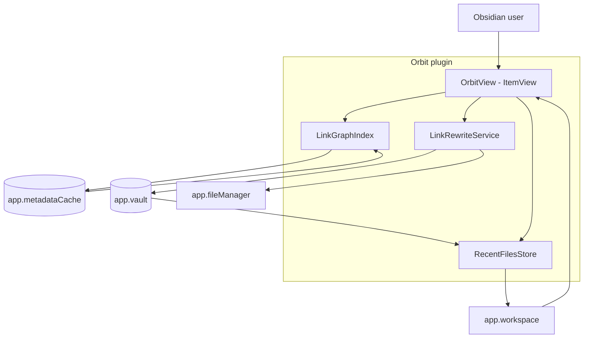
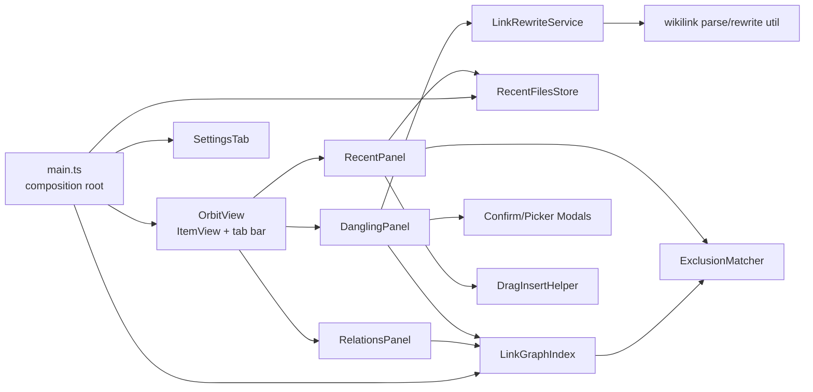
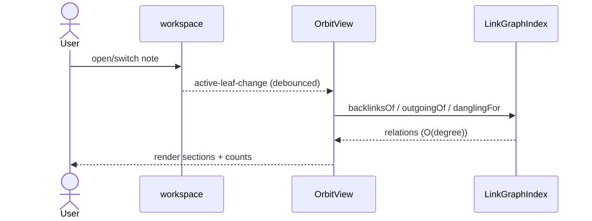

# Solution Design Document

## Validation Checklist

### CRITICAL GATES (Must Pass)

- [x] All required sections are complete
- [x] No [NEEDS CLARIFICATION] markers remain
- [x] Architecture pattern is clearly stated with rationale
- [x] **All architecture decisions confirmed by user**
- [x] Every interface has specification

### QUALITY CHECKS (Should Pass)

- [x] All context sources are listed with relevance ratings
- [x] Project commands are discovered from actual project files
- [x] Constraints → Strategy → Design → Implementation path is logical
- [x] Every component in diagram has directory mapping
- [x] Error handling covers all error types
- [x] Quality requirements are specific and measurable
- [x] Component names consistent across diagrams
- [x] A developer could implement from this design

---

## Constraints

- **CON-1 (Platform/API):** Obsidian community plugin on the public TypeScript API (`obsidian` peer dep `>=1.5.7`, `minAppVersion 1.5.7`). TypeScript strict mode, no `any`. Desktop **and** mobile (`isDesktopOnly: false`).
- **CON-2 (Build/standards):** esbuild bundle to `main.js`; `tsc --noEmit` typecheck; vitest unit tests with the repo's `obsidian` mock; eslint (`eslint-plugin-obsidianmd`) + stylelint. TDD required (RED→GREEN→REFACTOR per `src/CLAUDE.md`). `main.ts` stays thin (lifecycle wiring only). All listeners/timers via `this.register*`.
- **CON-3 (Submission rules):** Must pass Obsidian community-directory review. XSS-safe DOM only (`createEl`/`createDiv`/`empty()`, never `innerHTML`). `console.debug` not `console.log`. Sentence-case UI text. No `eslint-disable`. `normalizePath` for vault-relative paths only. Popout-safe globals (`activeDocument`/`activeWindow`). No `app` global; use `this.app`.
- **CON-4 (Licensing):** Orbit ships **MIT**. GPL-3.0 source (`recent-files-obsidian`, `broken-links`) is **reimplemented from patterns, never copied**. MIT source (`relation-pane`, `dangling-links`) may be referenced with attribution.
- **CON-5 (No network/telemetry):** Operates only on the local vault. No data leaves the device.
- **CON-6 (Performance):** Responsive on 10k–50k-note vaults — no full link-graph scan per navigation; no UI freeze during bulk operations.
- **CON-7 (No cross-file undo):** Obsidian has no atomic multi-file transaction. Destructive vault-wide ops are gated by preview + confirmation + backup warning, not rollback.

## Implementation Context

**IMPORTANT**: Read and analyze ALL listed context sources before implementing.

### Required Context Sources

#### Documentation Context
```yaml
- doc: docs/XDD/specs/001-orbit-three-tab-sidebar/requirements.md
  relevance: CRITICAL
  why: "The PRD — all 6 Must-have features and 34 acceptance criteria trace here"

- doc: src/CLAUDE.md
  relevance: HIGH
  why: "TDD cycle, strict-TS rules, thin-main.ts rule, register* cleanup, no runtime <style>"

- doc: CLAUDE.md (+ ~/Kouzou/standards/general.md)
  relevance: MEDIUM
  why: "Branch-before-edit, commit-after-task, plan mode >2 files, build commands"

- url: https://docs.obsidian.md/Reference/TypeScript+API/MetadataCache
  relevance: CRITICAL
  why: "resolvedLinks / unresolvedLinks / getFileCache / getFirstLinkpathDest — the data sources"

- url: https://docs.obsidian.md/Reference/TypeScript+API/Vault/process
  relevance: CRITICAL
  why: "Atomic per-file edit API for bulk rewrites (keeps editors in sync)"

- url: https://docs.obsidian.md/Reference/TypeScript+API/FileManager
  relevance: HIGH
  why: "renameFile (real-target merge), generateMarkdownLink (link format), getNewFileParent"
```

#### Code Context
```yaml
- file: src/main.ts
  relevance: HIGH
  why: "Plugin entry. Currently scaffold-thin; will register the view + commands + index lifecycle"

- file: src/types/index.ts
  relevance: HIGH
  why: "PluginSettings + DEFAULT_SETTINGS — to be replaced with Orbit's settings shape"

- file: src/settings/SettingsTab.ts
  relevance: HIGH
  why: "Existing settings-tab pattern (HeaderSection, Setting builder) to extend"

- file: test/__mocks__/obsidian.ts
  relevance: HIGH
  why: "The obsidian mock unit tests run against; defines what APIs tests can exercise (incl. _runCleanup())"

- file: esbuild.config.mjs
  relevance: MEDIUM
  why: "Bundling; confirms no Svelte toolchain (informs ADR-3 vanilla-DOM choice)"

- file: package.json
  relevance: MEDIUM
  why: "Scripts (build/test/lint), MIT license, obsidian peer dep version"
```

#### External APIs
```yaml
- service: Obsidian app (in-process)
  doc: https://docs.obsidian.md
  relevance: HIGH
  why: "All data + writes go through app.metadataCache, app.vault, app.fileManager, app.workspace. No external services."
```

### Implementation Boundaries

- **Must Preserve:** Scaffold conventions — thin `main.ts`, path aliases (`settings/`, `types/`), `register*` cleanup (asserted by mock `_runCleanup()`), strict TS, `styles.css` (no runtime `<style>`), MIT license, manifest `id: "orbit"` (stable — never change).
- **Can Modify:** `src/types/index.ts` (replace placeholder settings), `src/settings/SettingsTab.ts` (real settings), `src/main.ts` (wire view + commands + index), `styles.css` (add prefixed `orbit-*` rules), `manifest.json` description (must end with punctuation, ≤250 chars, no "Obsidian").
- **Must Not Touch:** `.githooks/`, release/CI workflows, `LICENSE`, `manifest.json` `id`.

### External Interfaces

#### System Context Diagram



#### Interface Specifications

This is an in-process Obsidian plugin: there are **no HTTP/DB/queue interfaces**. The "interfaces" are Obsidian API surfaces (inbound events Orbit subscribes to; outbound calls Orbit makes) and Orbit's internal module contracts (see Building Block View → Interface Specifications).

```yaml
inbound:  # Obsidian events Orbit reacts to
  - name: "workspace.on('active-leaf-change')"
    data_flow: "Active note changed → debounced Relations refresh"
  - name: "workspace.on('file-open')"
    data_flow: "File opened → push to RecentFilesStore (MRU)"
  - name: "metadataCache.on('resolved')"
    data_flow: "Whole-cache settle → initial LinkGraphIndex build (once, after layout ready)"
  - name: "metadataCache.on('changed', file)"
    data_flow: "Single file reindexed → incremental index update for that file"
  - name: "vault.on('rename') / vault.on('delete')"
    data_flow: "Retarget/drop index edges + recent-list entries"

outbound:  # Obsidian calls Orbit makes
  - name: "vault.process(file, fn)"
    data_flow: "Atomic per-file body rewrite for bulk rename/alias/delete"
  - name: "fileManager.renameFile(file, newPath)"
    data_flow: "Merge into an existing real note (Obsidian updates inbound links)"
  - name: "fileManager.generateMarkdownLink(...)"
    data_flow: "Build replacement links in the user's preferred format"
  - name: "fileManager.getNewFileParent / vault.create"
    data_flow: "Create-missing-note action"
  - name: "workspace.getLeaf(...).openFile / openLinkText"
    data_flow: "Click / cmd-click navigation"
  - name: "workspace.trigger('hover-link', ...)"
    data_flow: "Delegate hover preview to core Page preview"
  - name: "app.dragManager.dragFile (internal) + metadataCache.getFirstLinkpathDest"
    data_flow: "Desktop drag-to-insert wikilink (with mobile insert fallback)"
```

### Project Commands

```bash
Install: npm install
Dev:     npm run dev          # esbuild watch
Test:    npm test             # vitest run  (npm run test:watch for watch)
Lint:    npm run lint         # eslint src/ + stylelint styles.css
Build:   npm run build        # tsc --noEmit -skipLibCheck && esbuild production
Typecheck: npm run typecheck
Coverage:  npm run test:coverage
```

## Solution Strategy

- **Architecture Pattern:** Modular layered plugin. A single `ItemView` (presentation) renders one of three **panel** modules; panels read from **service/state** modules (`LinkGraphIndex`, `RecentFilesStore`, `LinkRewriteService`); services wrap the Obsidian API. `main.ts` is a thin composition root that constructs services, registers the view/commands/events, and owns lifecycle.
- **Integration Approach:** Pure client-side Obsidian plugin. Data is derived from `metadataCache`; writes go through `vault.process` / `fileManager`. No new persistence store beyond `saveData`/`loadData` (settings + recent list) and the `ItemView` `getState/setState` (active tab + scope).
- **Justification:** Matches the scaffold (thin main, modules under `src/`), keeps each tab independently testable against the obsidian mock, isolates the one risky internal API (drag manager) behind a service, and lets the expensive link-graph computation live in one reusable, incrementally-maintained index rather than being recomputed per panel/event (the perf flaw in relation-pane).
- **Key Decisions:** Single tabbed `ItemView` (ADR-1); incremental reverse-index link graph (ADR-2); vanilla DOM rendering (ADR-3); Dangling grouped by-target with toggle (ADR-4); hybrid bulk-rewrite engine — `renameFile` for real targets, offset-splice `vault.process` for danglings (ADR-5); alias targets restricted to existing notes (ADR-6); Recent Files parity is a v1 launch gate (ADR-7); settings via `saveData`, ephemeral view state via `getState/setState` (ADR-8).

## Building Block View

### Components



### Directory Map

**Component**: orbit (single plugin)
```
.
├── src/
│   ├── main.ts                       # MODIFY: register view, commands, index, events (thin)
│   ├── view/
│   │   ├── OrbitView.ts              # NEW: ItemView, tab bar, panel routing, getState/setState
│   │   ├── TabBar.ts                 # NEW: accessible tablist (role=tab/tablist), active state
│   │   └── panels/
│   │       ├── RelationsPanel.ts     # NEW: Outgoing/Backlinks/2nd-hop/Missing sections
│   │       ├── DanglingPanel.ts      # NEW: grouped tree + inline actions + scope toggle
│   │       └── RecentPanel.ts        # NEW: recent list, click/drag/remove/clear
│   ├── graph/
│   │   ├── LinkGraphIndex.ts         # NEW: reverse index, incremental updates, 2nd-hop query
│   │   └── relations.ts              # NEW: pure functions (outgoing/backlinks/2ndHop/missing)
│   ├── links/
│   │   ├── LinkRewriteService.ts     # NEW: rename/merge, alias, delete (vault-wide), preview
│   │   ├── wikilink.ts               # NEW: parse + rewrite single link, preserve alias/#/^/!
│   │   └── createNote.ts             # NEW: create-missing-note (path picker + vault.create)
│   ├── recent/
│   │   ├── RecentFilesStore.ts       # NEW: MRU list, dedup, prune, persist, rename/delete sync
│   │   └── DragInsertHelper.ts       # NEW: dragManager.dragFile + mobile insert fallback
│   ├── shared/
│   │   ├── ExclusionMatcher.ts       # NEW: path-regex + frontmatter-tag exclusion predicate
│   │   ├── obsidian-augment.d.ts     # NEW: type augmentation for app.dragManager (internal)
│   │   └── debounce.ts               # NEW (or re-export obsidian debounce) for refresh
│   ├── modals/
│   │   ├── ConfirmRewriteModal.ts    # NEW: preview "X occurrences in Y files" + confirm
│   │   └── NotePickerModal.ts        # NEW: FuzzySuggestModal over notes/folders
│   ├── settings/
│   │   ├── SettingsTab.ts            # MODIFY: real Orbit settings
│   │   └── HeaderSection.ts          # KEEP
│   └── types/
│       └── index.ts                  # MODIFY: OrbitSettings + DEFAULT_SETTINGS + domain types
├── styles.css                        # MODIFY: prefixed orbit-* classes (no inline styles)
└── test/                             # NEW tests mirror src/ (TDD; against obsidian mock)
```

### Interface Specifications

#### Application Data Models

```typescript
// src/types/index.ts (replaces placeholder)
type DanglingGrouping = "target" | "source";
type DanglingScope = "vault" | "folder";
type TabId = "relations" | "dangling" | "recent";

interface OrbitSettings {
  recentListLength: number;          // default 20
  excludePathPatterns: string[];     // regex, one per line (matched against file.path)
  excludeTagPatterns: string[];      // regex, matched against frontmatter tags
  secondHopCap: number;              // default 50; 0 disables 2nd hop
  secondHopEnabled: boolean;         // default true
  refreshDebounceMs: number;         // default 300
  danglingDefaultScope: DanglingScope;   // default "vault"
  danglingGrouping: DanglingGrouping;    // default "target"
  newNoteFolder: string;             // "" = Obsidian default location
  defaultTab: TabId;                 // default "relations"
  showCounts: boolean;               // default true
  recentFiles: { path: string; basename: string }[]; // persisted MRU list
}

// Ephemeral per-leaf view state (getState/setState, NOT saveData)
interface OrbitViewState {
  activeTab: TabId;
  danglingScope: DanglingScope;
  collapsedSections: string[];       // Relations section keys collapsed
}

// Relations query result (graph/relations.ts)
interface RelationItem { path: string; display: string; }            // resolved note
interface SecondHopGroup { via: RelationItem; items: RelationItem[]; }
interface MissingItem { target: string; }                            // unresolved target referenced by active note
interface RelationsResult {
  outgoing: RelationItem[];
  backlinks: RelationItem[];
  secondHop: SecondHopGroup[];       // deduped; excludes active note + all 1st-hop
  missing: MissingItem[];
  truncated: boolean;                // 2nd-hop hit the cap
}

// Dangling model (graph/LinkGraphIndex.ts)
interface DanglingOccurrence { sourcePath: string; count: number; }
interface DanglingTarget { target: string; occurrences: DanglingOccurrence[]; totalCount: number; }
```

#### Internal Module Contracts

```typescript
// graph/LinkGraphIndex.ts — built once, updated incrementally
class LinkGraphIndex {
  buildFull(): void;                         // on first metadataCache 'resolved' after layout ready
  updateFile(path: string): void;            // on metadataCache 'changed' (diff old/new edges)
  removeFile(path: string): void;            // on vault delete
  renameFile(oldPath: string, newPath: string): void; // on vault rename
  backlinksOf(path: string): string[];       // O(degree) via reverse index
  outgoingOf(path: string): string[];
  danglingTargets(scope: { folder?: string }): DanglingTarget[];
  danglingFor(target: string): DanglingTarget | null; // for Relations "Manage →" deep link
}

// links/wikilink.ts — pure, the riskiest correctness surface (heavily unit-tested)
interface ParsedLink { full: string; target: string; subpath: string; alias: string; embed: boolean; }
function parseLinkAtOffset(text: string, startOffset: number, endOffset: number): ParsedLink;
function rewriteTarget(link: ParsedLink, newTarget: string): string;   // preserves #heading/#^block/|alias/!
function toAlias(link: ParsedLink, realTarget: string): string;        // [[realTarget|originalText]]
function removeLink(link: ParsedLink): string;                         // -> alias text or ""

// links/LinkRewriteService.ts — vault-wide ops, all return a preview first
interface RewritePreview { occurrences: number; files: { path: string; count: number }[]; }
class LinkRewriteService {
  previewRename(target: string, scope): Promise<RewritePreview>;
  applyRename(target: string, newName: string, scope): Promise<BulkResult>;   // merge if newName is real note
  applyAlias(target: string, realNotePath: string, scope): Promise<BulkResult>;
  applyDelete(target: string, scope, onlyInActiveNote: boolean): Promise<BulkResult>;
}
interface BulkResult { filesSucceeded: number; filesFailed: { path: string; error: string }[]; }
```

### Implementation Examples

#### Example: 2nd-hop computation (deduped, capped)

**Why this example**: relation-pane's 2nd-hop was shallow (outgoing-only), undeduped, and crashed when the active note was absent from the link map. This is the corrected algorithm.

```typescript
// graph/relations.ts (guarded, deduped, capped)
function secondHop(index: LinkGraphIndex, active: string, firstHop: Set<string>, cap: number): SecondHopGroup[] {
  const groups: SecondHopGroup[] = [];
  const seen = new Set<string>([active, ...firstHop]); // exclude self + 1st hop
  let budget = cap;
  for (const via of firstHop) {
    if (budget <= 0) break;
    const related = [...index.backlinksOf(via), ...index.outgoingOf(via)]; // both directions
    const items: RelationItem[] = [];
    for (const path of related) {
      if (seen.has(path)) continue;     // global cross-hop dedup
      seen.add(path);
      items.push(toItem(path));
      if (--budget <= 0) break;
    }
    if (items.length) groups.push({ via: toItem(via), items });
  }
  return groups;
}
// Edge case: active note absent from cache → index.outgoingOf returns [] (guarded), no throw.
```

#### Example: bulk rename via offset-splice (back-to-front)

**Why this example**: editing by cached link offsets, descending, is the only safe way to rewrite multiple links in one file without invalidating later offsets, and it preserves alias/heading/block/embed.

```typescript
// inside LinkRewriteService.applyRename, per file:
await vault.process(file, (data) => {
  const cache = metadataCache.getFileCache(file);
  const hits = collectLinks(cache, target);              // links + embeds + frontmatterLinks matching target (case-insensitive)
  hits.sort((a, b) => b.position.start.offset - a.position.start.offset); // DESCENDING
  let out = data;
  for (const h of hits) {
    const parsed = parseLinkAtOffset(out, h.position.start.offset, h.position.end.offset);
    const replacement = rewriteTarget(parsed, newName);
    out = out.slice(0, h.position.start.offset) + replacement + out.slice(h.position.end.offset);
  }
  return out;
});
// Frontmatter links handled via processFrontMatter, not body splicing.
```

## Runtime View

### Primary Flow: Relations refresh on navigation

1. User switches notes → `active-leaf-change` fires.
2. Orbit debounces (`refreshDebounceMs`, trailing) to coalesce rapid switches.
3. `RelationsPanel` queries `LinkGraphIndex` (O(degree), no full scan) for outgoing/backlinks; computes deduped/capped 2nd-hop; reads `unresolvedLinks` of the active note for "Missing".
4. Panel re-renders sections with counts; empty state if no active markdown note.



### Secondary Flow: Vault-wide rename/merge

```mermaid
sequenceDiagram
    actor User
    participant Dang as DanglingPanel
    participant Ops as LinkRewriteService
    participant Modal as ConfirmRewriteModal
    participant Vault as vault/fileManager
    User->>Dang: click rename on target
    Dang->>User: prompt new/target name
    Dang->>Ops: previewRename(target, scope)
    Ops-->>Modal: "X occurrences in Y files" (+ no-undo warning)
    User->>Modal: confirm
    Modal->>Ops: applyRename (re-resolve counts first)
    alt newName resolves to a real note
        Ops->>Vault: rewrite links to that note (generateMarkdownLink)
    else still dangling
        Ops->>Vault: vault.process offset-splice per file (sequential)
    end
    Ops-->>User: Notice "Updated N of M files; K failed"
```

### Error Handling

- **No active markdown note (Relations):** render empty state, never throw. Active note absent from link map → guarded `[]`, no crash (fixes relation-pane bug).
- **Click on now-missing file:** `Notice("File no longer exists")`, remove from list/index; self-heal.
- **Rename collision (target = existing note):** ConfirmRewriteModal surfaces it as an explicit "Merge into existing note 'X'" path; never silent overwrite. Invalid/empty name → inline validation blocks confirm.
- **Concurrent edit / stale counts:** re-resolve occurrence counts at confirm time; if changed since preview, re-prompt.
- **Bulk partial failure:** continue per-file, accumulate failures, report `Notice("Updated N of M files; K failed")`; never abort whole batch silently.
- **Long lists / hub notes:** render first ~100 rows with "show more"; 2nd-hop hard cap; debounced refresh prevents DOM thrash.
- **Internal drag API absent (mobile / API change):** feature-detect `app.dragManager`; fall back to tap-to-insert-at-cursor.

### Complex Logic — incremental index update

```
ALGORITHM: updateFile(path) on metadataCache 'changed'
INPUT: path, fresh getFileCache(path)
1. oldDests = forwardIndex.get(path)               // edges last known for this file
2. FOR each d in oldDests: reverseIndex[d].delete(path)   // remove stale reverse edges
3. newResolved = keys(resolvedLinks[path]); newUnresolved = keys(unresolvedLinks[path])
4. forwardIndex.set(path, newResolved)
5. FOR each d in newResolved: reverseIndex[d].add(path)
6. unresolvedIndex.set(path, newUnresolved)         // for dangling queries
7. (no full scan — cost is O(degree of this file))
```

## Deployment View

### Single Application Deployment
- **Environment:** Runs inside Obsidian (desktop Electron + mobile) as a community plugin. No server.
- **Configuration:** None external. User settings in vault `data.json` via `saveData`.
- **Dependencies:** Obsidian `>=1.5.7`. No runtime npm dependencies bundled beyond the plugin code (vanilla DOM — no Svelte/runtime lib).
- **Performance:** Index build once on load (after `onLayoutReady` + first `resolved`); incremental thereafter. Debounced refresh (~300ms). Bulk ops sequential with progress Notice. Targets 10k–50k notes without freeze.
- **Release:** semantic-release pipeline (already configured) builds `main.js`/`manifest.json`/`styles.css`; tag must equal `manifest.version`. Mobile-compatible (`isDesktopOnly: false`).

## Cross-Cutting Concepts

### System-Wide Patterns
- **DOM / XSS:** All rendering via `createEl`/`createDiv`/`createSpan` + `el.empty()`. Note titles, alias text, link targets are user-derived — never interpolated into HTML. Reuse native classes (`tree-item`, `tree-item-self`, `collapse-icon`, `clickable-icon`, `is-active`, `nav-buttons-container`) so themes style Orbit for free.
- **Performance:** One reverse index (dest→sources), built once, updated incrementally; debounced view refresh; configurable 2nd-hop cap; sequential progress-reported bulk writes; yield periodically during large batches to keep UI responsive.
- **Error handling:** Local-only — `Notice` for user-facing feedback, `console.debug` for diagnostics; guard every link-map lookup; graceful self-heal on missing files.
- **Persistence:** `saveData/loadData` for settings + recent list (`Object.assign({}, DEFAULT_SETTINGS, loaded)`); `ItemView.getState/setState` for ephemeral per-leaf state (active tab, scope, collapsed sections). `onExternalSettingsChange` re-reads settings for Sync. Read settings live via `this.plugin.settings`, never a captured snapshot. In-memory index is derived — never persisted.
- **Accessibility:** Tab bar `role="tablist"` with `role="tab"`/`aria-selected`/roving tabindex; arrow-key nav; panels `role="tabpanel"`. Icon-only action buttons get `aria-label` + tooltip. Focus moves to the new panel on switch and to the next sibling after a row is removed. `aria-live="polite"` announces bulk results.
- **Mobile:** ≥44px touch targets; action icons reachable without hover (always-visible or overflow on touch); drag-to-link is desktop-only with a tap-to-insert fallback everywhere; tab labels collapse to icons on narrow widths; no Node-only APIs.
- **Cleanup:** Every event/DOM listener/interval/timer via `this.register*` (or tracked + cleared for debounce/grace timers). `onunload` does NOT detach the leaf.

### User Interface & UX

**Information Architecture:** One right-sidebar `ItemView` (`VIEW_TYPE = "orbit"`, icon, "Orbit"). Top tab bar → one of three panels. Relations & Dangling are tree/section lists; Recent is a flat list.

**Entry point:**
```
┌──────────────────────────────────────┐
│ [Relations] [Dangling] [Recent]      │  ← tablist (icons+labels; icons-only on narrow)
├──────────────────────────────────────┤
│ ▾ Outgoing · 4                        │
│    • Note A                           │
│ ▾ Backlinks · 12                      │
│ ▾ 2nd-hop · 8  (showing 8 of 23)      │
│ ▾ Missing · 2     [Manage →]          │
└──────────────────────────────────────┘
```

**Component states (Dangling action):**

```mermaid
stateDiagram-v2
    [*] --> Idle
    Idle --> Preview: choose action
    Preview --> Idle: cancel
    Preview --> Applying: confirm (re-resolve counts)
    Applying --> Done: all files ok
    Applying --> Partial: some failed
    Done --> Idle
    Partial --> Idle: show "N of M; K failed"
```


### Pattern Documentation
```yaml
- pattern: tcs-patterns:obsidian-plugin (skill)
  relevance: CRITICAL
  why: "Submission rules, lifecycle/cleanup, mobile, XSS-safe DOM, vault.process vs adapter.write"
- pattern: relation-pane (MIT, reference)
  relevance: MEDIUM
  why: "Relation computation reference (improve on its bugs); attribution if any code referenced"
- pattern: dangling-links (MIT, reference)
  relevance: MEDIUM
  why: "Unresolved-link enumeration reference"
```

## Architecture Decisions

- [x] **ADR-1 Single tabbed ItemView** (vs three separate views): one right-sidebar `ItemView` with an in-view tab bar.
  - Rationale: matches the PRD's "one pane" value prop; one leaf, one settings surface, shared index; standard Obsidian pattern (mobile-safe).
  - Trade-offs: only one tab visible at a time; tab state must persist per-leaf.
  - User confirmed: **Yes (2026-06-18)**

- [x] **ADR-2 Incremental reverse-index link graph** (vs on-demand full scan): build `dest→sources` once, update per changed file.
  - Rationale: O(degree) queries vs relation-pane's O(N·M) per navigation; required for 10k–50k vaults.
  - Trade-offs: in-memory index to keep consistent on changed/rename/delete; small memory cost; derived state rebuilt on load.
  - User confirmed: **Yes (2026-06-18)**

- [x] **ADR-3 Vanilla DOM rendering** (vs Svelte): render via `createEl`/native classes.
  - Rationale: no framework dependency, smallest bundle, XSS-safe, matches scaffold, simpler mobile/popout correctness; we reimplement anyway (license).
  - Trade-offs: manual DOM diffing/re-render (mitigated by re-rendering only the active panel + debounce).
  - User confirmed: **Yes (2026-06-18)**

- [x] **ADR-4 Dangling grouped by-target, toggle to by-source** (default "target").
  - Rationale: rename/merge/create operate on the target → by-target is the actionable default; toggle preserves the brief's by-source view.
  - Trade-offs: differs from brief's default wording (accepted by user).
  - User confirmed: **Yes (2026-06-18)**

- [x] **ADR-5 Hybrid bulk-rewrite engine**: `fileManager.renameFile` when the new target is a real note (merge); offset-splice `vault.process` for true danglings; `generateMarkdownLink` for new link text; `processFrontMatter` for frontmatter links.
  - Rationale: leverages Obsidian's native link-updating where possible; precise offset-splice preserves alias/heading/block/embed for danglings; respects user link format.
  - Trade-offs: two code paths; no cross-file undo (mitigated by preview + backup warning).
  - User confirmed: **Yes (2026-06-18)**

- [x] **ADR-6 Alias target = existing note only** (via FuzzySuggest picker), rewriting to `[[ExistingNote|originalText]]`.
  - Rationale: per brief; guarantees the alias resolves; avoids creating a new dangling target.
  - Trade-offs: cannot alias to a not-yet-existing note (use create-note instead).
  - User confirmed: **Yes (2026-06-18)**

- [x] **ADR-7 Recent Files parity is a v1 launch gate**: full list/length/exclusions/drag-to-link/mobile-insert before v1.
  - Rationale: lets users uninstall recent-files-obsidian immediately (PRD Feature 5).
  - Trade-offs: larger v1 scope.
  - User confirmed: **Yes (2026-06-18)**

- [x] **ADR-8 Persistence split**: settings + recent list via `saveData/loadData`; active tab/scope/collapsed-sections via `ItemView.getState/setState`.
  - Rationale: settings are global + Sync-replicated; tab/scope are per-leaf workspace state Obsidian already serializes.
  - Trade-offs: two persistence channels to keep straight.
  - User confirmed: **Yes (2026-06-18)**

## Quality Requirements

- **Performance:** Relations refresh after navigation completes within one debounce window (~300ms) with no perceptible freeze on a 50k-note vault; backlink/outgoing lookup is O(degree), not O(vault). 2nd-hop bounded by `secondHopCap`. Bulk rewrite over thousands of occurrences keeps the UI responsive (periodic yield) and shows progress.
- **Usability/Accessibility:** Keyboard-operable tabs and rows; icon-only buttons labelled; empty states for every tab; ≥44px touch targets on mobile; sentence-case UI.
- **Reliability/Data integrity:** Bulk rewrites preserve all wikilink forms (`[[t]]`,`[[t|a]]`,`[[t#h]]`,`[[t#^b]]`,`![[t]]`) — zero malformed links; preview counts match applied changes (re-resolved at confirm); partial failures reported, never silent; open editors stay in sync (`vault.process`).
- **Maintainability:** Strict TS, no `any`; `wikilink.ts` and `relations.ts` are pure and unit-tested across all link forms and edge cases (empty note, hub note, missing file); main.ts stays thin.
- **Submission:** Passes `eslint-plugin-obsidianmd`, stylelint, build, and Obsidian directory review (manifest + XSS + cleanup + mobile).

## Acceptance Criteria

**Tabbed pane: [PRD/AC Feature 1]**
- [ ] WHEN the user opens the Orbit pane, THE SYSTEM SHALL show one right-sidebar view with a tablist of Relations, Dangling links, Recent files, with the active tab marked `aria-selected`.
- [ ] WHEN Obsidian reloads, THE SYSTEM SHALL restore the last-active tab and Dangling scope from view state.
- [ ] WHILE focus is on the tablist, THE SYSTEM SHALL move/activate tabs via arrow keys and Enter/Space.

**Relations: [PRD/AC Feature 2]**
- [ ] WHEN a markdown note is active, THE SYSTEM SHALL render Outgoing, Backlinks, 2nd-hop, and Missing sections each with a count.
- [ ] THE SYSTEM SHALL deduplicate 2nd-hop results and exclude the active note and all 1st-hop notes, capped at `secondHopCap` with a "showing N of M" indicator when truncated.
- [ ] WHEN a relation row is clicked, THE SYSTEM SHALL open the target in the current leaf; WHEN cmd/ctrl/middle-clicked, in a new leaf.
- [ ] WHERE Page preview is enabled, WHEN a row is hovered, THE SYSTEM SHALL trigger `hover-link`.
- [ ] WHEN the active note references non-existent targets, THE SYSTEM SHALL list them under "Missing" with a "Manage →" control that opens the Dangling tab filtered to that target.
- [ ] IF no markdown note is active, THEN THE SYSTEM SHALL render an empty state.
- [ ] IF the active note is absent from the link map, THEN THE SYSTEM SHALL render empty sections without throwing.

**Dangling links + bulk ops: [PRD/AC Feature 3]**
- [ ] WHEN the Dangling tab opens, THE SYSTEM SHALL list unresolved targets grouped by target (default), vault-wide (default), with occurrence counts.
- [ ] WHEN the user toggles scope/grouping, THE SYSTEM SHALL re-render accordingly and reflect scope in copy/counts.
- [ ] WHEN the user confirms a rename, THE SYSTEM SHALL first show "X occurrences in Y files" with a non-reversible warning, then rewrite all matches via the hybrid engine keeping editors in sync.
- [ ] IF the new name resolves to an existing note, THEN THE SYSTEM SHALL present a merge path and update links to that note in the user's link format.
- [ ] WHEN the user chooses Change to alias and picks an existing note, THE SYSTEM SHALL rewrite occurrences to `[[note|originalText]]`.
- [ ] WHEN the user chooses Create missing note, THE SYSTEM SHALL let them pick a destination and create the note there.
- [ ] WHEN the user chooses Delete link, THE SYSTEM SHALL require confirmation (with an "only in this note" option) before removing the link syntax.
- [ ] THE SYSTEM SHALL preserve alias, `#heading`, `#^block`, and `!`-embed parts during any rewrite.
- [ ] IF some files fail mid-batch, THEN THE SYSTEM SHALL report "Updated N of M files; K failed".

**Recent files: [PRD/AC Feature 4]**
- [ ] WHEN a file is opened, THE SYSTEM SHALL prepend it to the recent list (deduped, MRU), capped at `recentListLength`.
- [ ] WHEN a recent row is clicked / cmd-clicked, THE SYSTEM SHALL open in current / new leaf.
- [ ] WHERE on desktop, WHEN a row is dragged into the editor, THE SYSTEM SHALL insert a `[[wikilink]]`; WHERE on mobile, the insert action SHALL insert at the cursor.
- [ ] WHERE exclusion patterns match a file, THE SYSTEM SHALL omit it from the list.
- [ ] WHEN a listed file is renamed/deleted, THE SYSTEM SHALL update the list; clicking a missing file SHALL fail gracefully.
- [ ] WHEN the user removes an entry or clears the list, THE SYSTEM SHALL persist the change.

**Settings: [PRD/AC Feature 6]**
- [ ] THE SYSTEM SHALL expose settings for list length, exclusions, 2nd-hop cap/enable, debounce, default scope, grouping, new-note folder, default tab, show-counts.
- [ ] WHEN a setting changes, THE SYSTEM SHALL persist and reflect it without restart; WHEN settings change via Sync, `onExternalSettingsChange` SHALL re-read them.

## Risks and Technical Debt

### Known Technical Issues
- relation-pane's unguarded `Object.keys` crash when the active note is absent from the link map — Orbit must guard all lookups (called out in `relations.ts`).
- Bulk vault edits are not collectively undoable in Obsidian — inherent limitation, mitigated by preview + warning.

### Technical Debt
- None inherited (greenfield scaffold). Avoid replicating relation-pane's per-event full-scan and recent-files' over-broad `.toString()` tag matching.

### Implementation Gotchas
- **Internal drag API** (`app.dragManager.dragFile`) is undocumented — isolate in `DragInsertHelper`, feature-detect, provide tap fallback. Type via `obsidian-augment.d.ts`.
- **`metadataCache` timing:** the cache may still populate at `onLayoutReady`; gate the first full index build on the first `resolved` event.
- **Offset invalidation:** splice links **descending by offset**; re-read `getFileCache` inside the same `vault.process` callback.
- **Case-insensitive** target matching (Obsidian resolves links case-insensitively) — normalize when matching, preserve original case where kept.
- **Frontmatter links** live in YAML — rewrite via `processFrontMatter`, not body splicing.
- **`active-leaf-change` vs `file-open`:** use `active-leaf-change` for Relations (more robust than `file-open` for same-file leaf switches); `file-open` for the recent list.
- **Don't `detachLeavesOfType` in `onunload`** (Obsidian anti-pattern); let the leaf reinitialize.

## Glossary

### Domain Terms
| Term | Definition | Context |
|------|------------|---------|
| Dangling / unresolved link | A `[[wikilink]]` whose target note does not exist | Dangling tab; Relations "Missing" |
| 2nd hop | Notes connected to the active note's neighbours but not directly to it | Relations tab; Scrapbox-style discovery |
| Merge | Renaming a dangling target to a name that already exists, consolidating spellings | Rename/merge action |
| Backlink | A note that links to the active note | Relations tab |

### Technical Terms
| Term | Definition | Context |
|------|------------|---------|
| Reverse index | `Map<destPath, Set<sourcePath>>` for O(degree) backlink lookup | LinkGraphIndex |
| Offset-splice | Replacing substrings by character offsets, applied descending | wikilink rewrite |
| MRU | Most-recently-used ordering | RecentFilesStore |
| View state | Per-leaf JSON serialized by Obsidian via getState/setState | active tab/scope |

### API/Interface Terms
| Term | Definition | Context |
|------|------------|---------|
| `vault.process(file, fn)` | Atomic read-modify-write of a note, editor-sync-safe | bulk rewrites |
| `resolvedLinks` / `unresolvedLinks` | metadataCache maps `source → {dest → count}` | index build |
| `getFirstLinkpathDest` | Resolves a link target to a TFile (or null) | resolution checks |
| `hover-link` | Workspace trigger that invokes core Page preview | hover preview |

---

## SDD Status Report

| Field | Value |
|-------|-------|
| specId | 001-orbit-three-tab-sidebar |
| architecture | Modular layered Obsidian plugin: single tabbed ItemView + incremental reverse-index graph + hybrid bulk-rewrite service |
| keyComponents | OrbitView/TabBar, RelationsPanel, DanglingPanel, RecentPanel, LinkGraphIndex, LinkRewriteService, wikilink util, RecentFilesStore, DragInsertHelper, ExclusionMatcher, modals |
| externalIntegrations | Obsidian app API only (metadataCache, vault, fileManager, workspace); no network |
| adrs | ADR-1..8 all CONFIRMED |
| validationPassed | critical gates pass |
| nextSteps | Proceed to PLAN (phase breakdown + task sequencing, TDD) |
