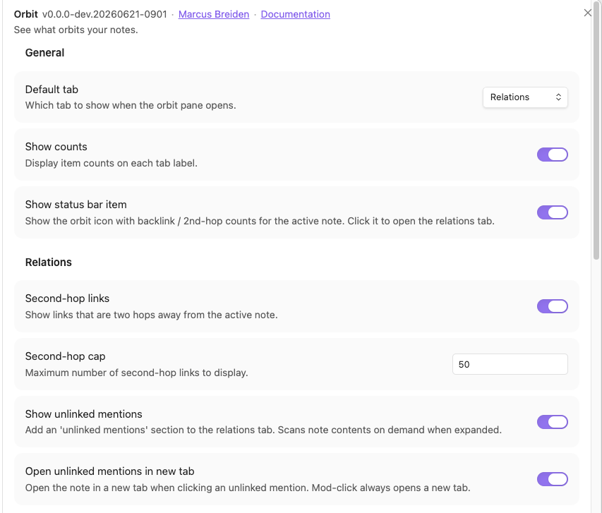
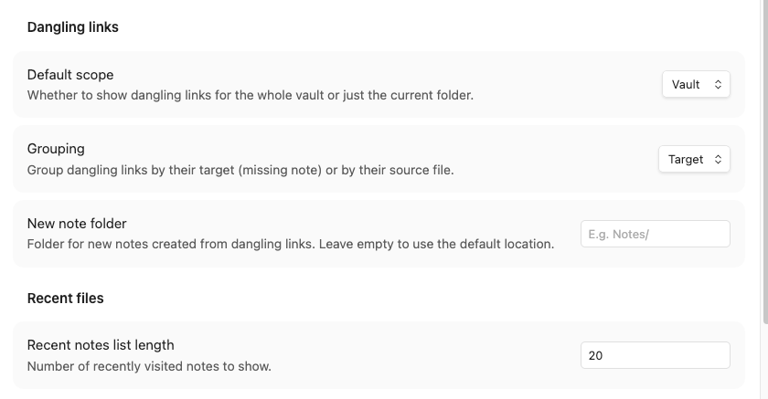
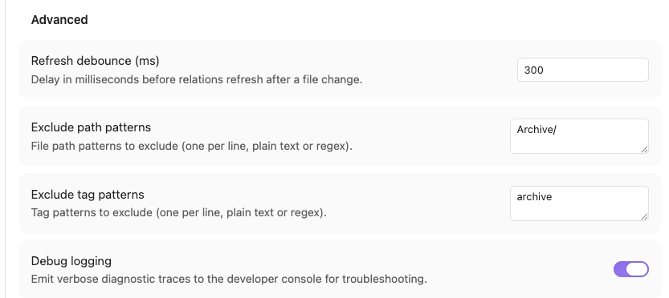

# Settings Reference

A deep reference for every Orbital setting, grouped exactly as they appear in
**Settings → Orbital**. For a quick name/type/default table, see
[Configuration](configuration.md); this page adds the effect of each setting and
when you'd want to change it.

## General

These settings appear at the top of the settings tab, above the first heading.

### Default tab

- **Type:** dropdown — Relations / Dangling links / Recent notes
- **Default:** Relations
- **Effect:** which tab is shown when the Orbital pane opens.
- **When to change:** pick the tab you open most often so it's there immediately.

### Show counts

- **Type:** toggle
- **Default:** on
- **Effect:** shows item counts on each tab label.
- **When to change:** turn off for a cleaner, label-only tab bar.

### Show status bar item

- **Type:** toggle
- **Default:** on
- **Effect:** shows the Orbital status-bar item with backlink / 2nd-hop counts for the
  active note; clicking it opens the Relations tab.
- **When to change:** turn off to reclaim status-bar space.

## Relations

### Second-hop links

- **Type:** toggle
- **Default:** on
- **Effect:** shows related notes two hops away from the active note (notes linked by
  your links or backlinks), deduplicated and excluding notes you already link directly.
- **When to change:** turn off in very large or densely linked vaults to cut noise.

### Second-hop cap

- **Type:** number
- **Default:** 50
- **Effect:** the maximum number of second-hop links displayed. Beyond the cap the list
  is truncated.
- **When to change:** lower it to reduce noise; raise it to see more related notes.

### Show unlinked mentions

- **Type:** toggle
- **Default:** on
- **Effect:** adds an "Unlinked mentions" section to the Relations tab. It scans note
  contents on demand only when you expand it.
- **When to change:** turn off if you don't use it, or to avoid the on-demand scan in
  very large vaults.

### Open unlinked mentions in new tab

- **Type:** toggle
- **Default:** off
- **Effect:** clicking an unlinked mention opens the note in a new tab. (Mod-click
  always opens a new tab regardless of this setting.)
- **When to change:** turn on if you prefer mentions to open alongside the current note.

## Dangling links

### Default scope

- **Type:** dropdown — Vault / Folder
- **Default:** Vault
- **Effect:** whether the Dangling links tab lists targets for the whole vault or just
  the active note's folder.
- **When to change:** choose Folder to focus on the area you're currently editing.

### Grouping

- **Type:** dropdown — Target / Source
- **Default:** Target
- **Effect:** groups dangling links by their target (the missing note) or by their
  source file. The source grouping also unlocks per-note deletion.
- **When to change:** use Source when you want to clean up one note at a time.

### New note folder

- **Type:** text (folder path) with folder autocomplete
- **Default:** empty
- **Effect:** the folder where the **Create note** action places new notes. Empty uses
  Obsidian's default location for new notes. Start typing to pick an existing vault
  folder from the suggestion dropdown, or type a path freely.
- **When to change:** set it to route created notes into a specific folder (e.g.
  `Notes/`).

## Recent files

### Recent notes list length

- **Type:** number
- **Default:** 20
- **Effect:** how many recently visited notes the Recent notes tab shows.
- **When to change:** raise it for a longer history; lower it for a shorter list.

## Advanced

### Refresh debounce (ms)

- **Type:** number (milliseconds)
- **Default:** 300
- **Effect:** the delay before the Relations tab refreshes after a file change.
  Debouncing prevents flicker when you switch notes rapidly.
- **When to change:** raise it on slower machines or large vaults to reduce churn;
  lower it for snappier updates.

### Exclude path patterns

- **Type:** text area — one pattern per line, plain text or regular expression
- **Default:** empty (nothing excluded)
- **Effect:** files whose path matches any pattern are excluded from Recent notes,
  Relations, and Unlinked mentions. An invalid regex is silently skipped.
- **When to change:** add folders you don't want surfaced, e.g. `Archive/` or
  `Templates/`.

### Exclude tag patterns

- **Type:** text area — one pattern per line, plain text or regular expression
- **Default:** empty (nothing excluded)
- **Effect:** notes carrying a tag that matches any pattern are excluded from Recent
  notes, Relations, and Unlinked mentions. Each tag is matched individually (not as a
  joined blob), and an invalid regex is silently skipped.
- **When to change:** add tags whose notes you want hidden, e.g. `archive` or `private`.

### Debug logging

- **Type:** toggle
- **Default:** off
- **Effect:** emits verbose `[Orbital]` traces to the developer console for diagnostics.
- **When to change:** turn on when reproducing a bug to capture detail for a report
  (see [Troubleshooting](troubleshooting.md)); leave off otherwise.

## See also

- [Configuration](configuration.md) — the at-a-glance name/type/default table.
- [Usage](usage.md) — how these settings play out in each tab.
