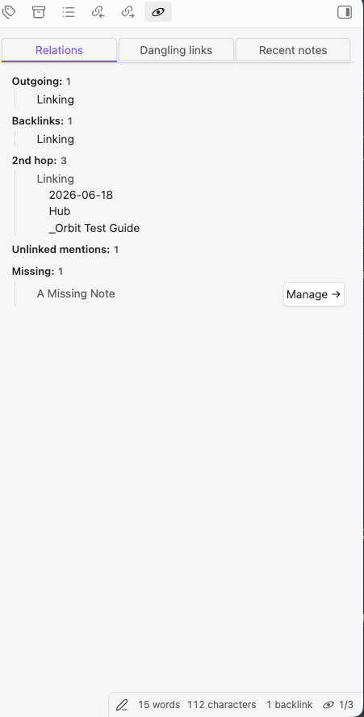
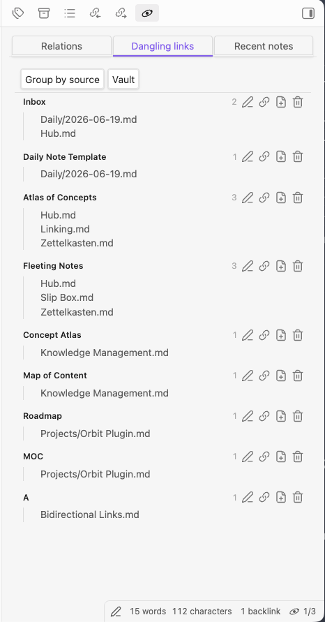
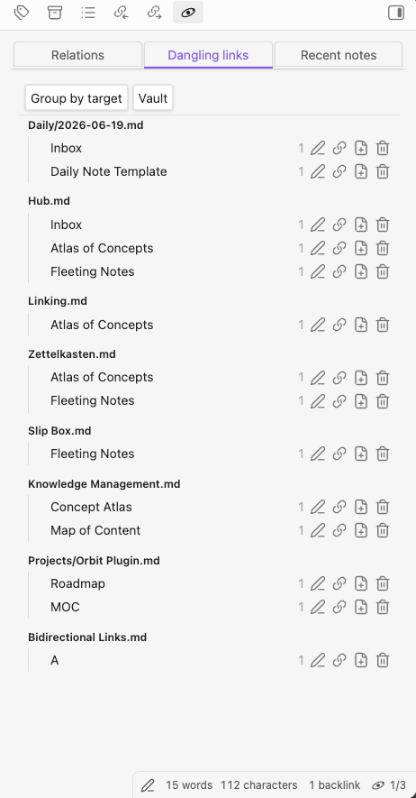
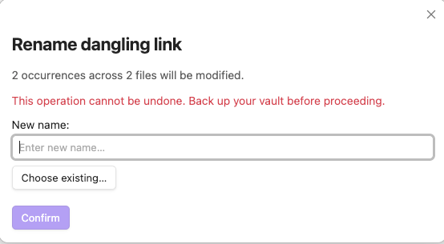
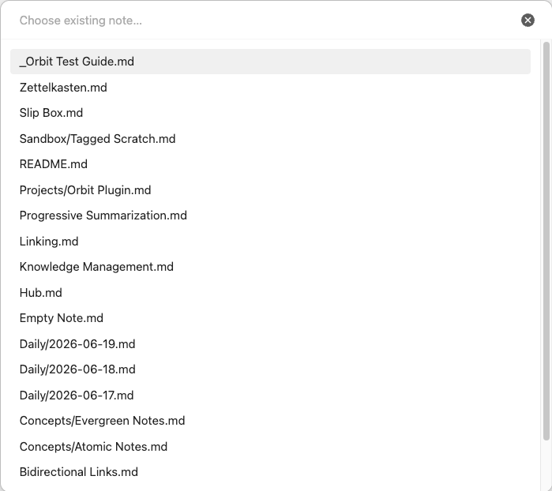
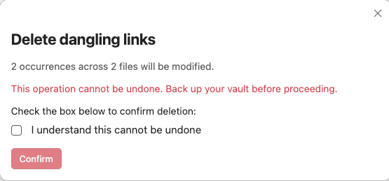
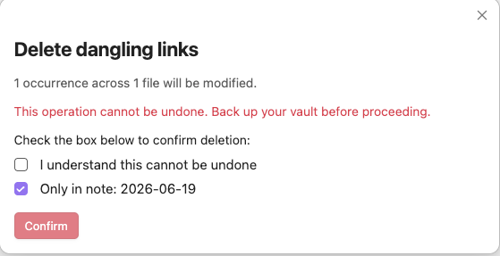
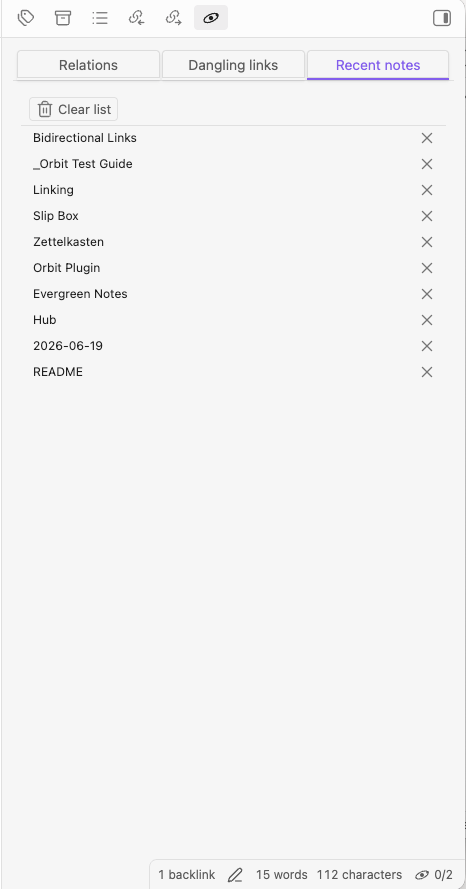

# Usage

Orbital puts three sidebar workflows — relations, dangling links, and recent notes —
into a single pane. This page walks through opening the pane and the everyday tasks
you'll repeat.

## First use

Open the pane with the **Orbital: Open** command from the command palette
(`Cmd/Ctrl-P`). It docks in the right sidebar as one pane with three tabs:
**Relations**, **Dangling links**, and **Recent notes**.

The Relations tab always reflects the **active note** and updates as you switch
notes (debounced, so rapid switching doesn't flicker).

## Common workflows

### Explore a note's relations

The Relations tab groups everything connected to the active note:

- **Outgoing** — links this note makes to others.
- **Backlinks** — notes that link back to this one.
- **2nd hop** — related notes one step further out, deduplicated and excluding notes
  you already link directly.
- **Unlinked mentions** — notes that mention this note's name (or an alias) in plain
  text without linking it. Collapsed by default; expand it to scan on demand.
- **Missing** — unresolved link targets in this note. Use **Manage →** to jump to the
  Dangling links tab pre-filtered to those targets.

Click a row to open it in the current pane; Mod-click (or middle-click) opens it in a
new tab.

### Fix dangling links in bulk

The Dangling links tab lists unresolved link targets. Switch the scope between
**Vault** and the active note's folder, and toggle grouping between **target** and
**source**.

> These actions edit the **dangling link's text inside your notes** — they don't touch
> a target file. There is no target note to begin with (the link is unresolved), so
> **Create note** is the only action that ever creates a file, and nothing here deletes
> a note.

Each row offers four actions — **rename**, **change to alias**, **create note**, and
**delete**:

- **Rename** rewrites every reference to a new target. If the new name matches an
  existing note or spelling, the references merge onto it. A preview shows how many
  occurrences across how many files will change.

  

- **Change to alias** replaces the broken link with an alias pointing at an existing
  note you pick from a fuzzy list.

  

- **Create note** creates a note for the target (in the folder set in your settings)
  and resolves the references.
- **Delete** unwraps the link, leaving its text as plain text in your notes
  (`[[Inbox]]` → `Inbox`, `[[Inbox|capture]]` → `capture`). It does **not** delete any
  note. From the **source** grouping you can scope this to a single note.

  

  

Every write operation is preview-confirmed and **cannot be undone** — back up your
vault first, as each dialog warns.

### Browse recent notes

The Recent notes tab is a most-recent-first list of opened notes.

Click a row to open it (Mod-click for a new tab), drag a row into an editor to insert
a `[[wikilink]]` at the drop point, remove a single entry with its **×**, or
**Clear list** to empty it. The list length and folder/tag exclusions are configurable
(see below).

## Tips and shortcuts

- **Mod-click / middle-click** any relation or recent row to open it in a new tab.
- **Hover** a row with the core *Page preview* plugin enabled to get a preview popover.
- **Status bar:** the Orbital item shows backlink / 2nd-hop counts for the active note —
  click it to jump straight to the Relations tab. Toggle it in settings.
- **Manage →** in the Missing section deep-links to the Dangling links tab filtered to
  that target; **Show all** restores the full list.
- Choose the default tab, count badges, exclusions, and more under **Settings → Orbital**.

## See also

- [Configuration](configuration.md) — every setting Orbital exposes.
- [Troubleshooting](troubleshooting.md) — common issues and how to get help.
